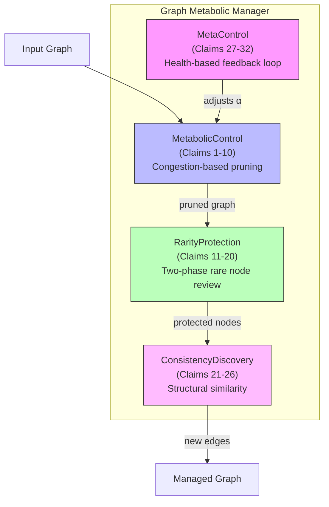

# Graph Metabolic Manager

[](https://github.com/ChaiCroquis/graph-metabolic-manager/actions/workflows/ci.yml)
[](https://www.python.org/downloads/)
[](LICENSE)

**Intelligent graph data structure management with automatic pruning, rarity protection, and hidden relationship discovery.**

[日本語版 / Japanese](README_ja.md)

---

## What is this?

Graph Metabolic Manager is a reference implementation of a patented algorithm for managing large-scale graph data structures. It solves three problems simultaneously:

| Problem | Solution | How |
|---|---|---|
| Data bloat | **Metabolic Control** | Adaptive edge weight decay based on local congestion |
| Loss of valuable data | **Rarity Protection** | Multi-phase review to protect isolated but valuable nodes |
| Missed connections | **Consistency Discovery** | Structural similarity analysis to find hidden relationships |

### Key Properties

- **Local-only computation** — No full graph traversal needed. Each edge is evaluated using only `deg(u) + deg(v)`
- **Scalable** — Works from small graphs to millions of nodes
- **Platform-agnostic** — Pure algorithm, implementable in any language
- **Verified** — 629 tests passing including 560 patent verification tests across 28 industries (see [Verification](#verification))

---

## Quick Start

```bash
# Install from source (development mode)
pip install -e .

# Or install just the dependency
pip install numpy
```

### Basic Usage

```python
from graph_metabolic_manager import Graph, GraphMetabolicManager

# Create a graph
g = Graph()
n1 = g.add_node("Product A")
n2 = g.add_node("Product B")
n3 = g.add_node("Rare Insight")
g.add_edge(n1, n2, weight=1.0)
g.add_edge(n1, n3, weight=0.1)

# Run the manager (all-in-one)
mgr = GraphMetabolicManager(g)
mgr.run(steps=100)
print(mgr.summary())
```

### Using Individual Components

```python
from graph_metabolic_manager import Graph, MetabolicControl, RarityProtection

g = Graph()
n1 = g.add_node("Product A")
n2 = g.add_node("Product B")
n3 = g.add_node("Rare Insight")
g.add_edge(n1, n2, weight=1.0)
g.add_edge(n1, n3, weight=0.1)

# Run metabolic control (auto-prune low-value edges)
mc = MetabolicControl()
mc.step(g, dt=1.0)

# Protect rare nodes from deletion
rp = RarityProtection()
rare_nodes = rp.identify_rare(g, t=0)
for nid in rare_nodes:
    rp.enter_protection(g, nid, t=0)
```

---

## Architecture



---

## How It Works

### 1. Metabolic Control (Auto-Pruning)

Each edge weight decays exponentially based on local congestion:

```
Decay rate:  λ(C) = β × (1 + γ × C^α)
Weight update: w ← w × exp(-λ × dt)
Congestion:  C = deg(u) + deg(v)
```

- **Crowded areas** → faster decay (aggressive cleanup)
- **Sparse areas** → slower decay (careful preservation)
- Edge removed when weight falls below threshold

### 2. Rarity Protection

Isolated nodes go through a two-phase review before deletion:

```
Phase 1 (Twait1 = 50 steps): Unconditional grace period
  → If node gains connections → Protected
  → If not → Move to Phase 2

Phase 2 (Twait2 = 50 steps): Conditional observation
  → If still isolated and no connections gained → Remove
  → If connections found → Keep
```

### 3. Consistency Discovery

Find hidden relationships using structural similarity:

```
1. Extract k-hop subgraph around each node
2. Compute Laplacian eigenvalue spectrum as structural fingerprint
3. Calculate consistency score: S = 7×S_sys + 2×S_rel + 1×S_attr
4. Accept if θ_L (0.70) ≤ S ≤ θ_U (0.80)
   → Too low: not similar enough
   → Too high: trivially obvious (sandwich threshold)
```

---

## Verification

Run the test suite:

```bash
pip install -e ".[dev]"
pytest tests/ -v
```

**629 tests** verify the core algorithms and patent features:

| Category | Tests | Status |
|---|---|---|
| Graph basics | 8 | All Pass |
| Mathematical model | 5 | All Pass |
| Metabolic control | 4 | All Pass |
| Rarity protection | 4 | All Pass |
| Consistency discovery | 16 | All Pass |
| Meta control | 4 | All Pass |
| Hierarchy management | 13 | All Pass |
| Integration (EC + manager) | 6 | All Pass |
| Trace logging (TRACE level) | 9 | All Pass |
| **Patent verification (28 industries × 20)** | **560** | **All Pass** |

The patent verification suite tests all 4 patent features (metabolic control, rarity protection, consistency discovery, meta control) across 28 industry scenarios. See [docs/verification_report.md](docs/verification_report.md) for the full report.

---

## Use Cases (28 Industry Examples)

Each use case has a runnable example demonstrating all patent features:

| Industry | Example | Key Protection Target |
|---|---|---|
| **General** | `01_basic_usage.py` | Basic usage and getting started |
| **E-Commerce** | `02_ec_recommendation.py` | Niche products |
| **Knowledge Management** | `03_knowledge_base.py` | Legacy documents |
| **Healthcare** | `04_medical_knowledge.py` | Orphan disease data |
| **Finance** | `05_financial_network.py` | Fraud signals |
| **IoT/Manufacturing** | `06_iot_manufacturing.py` | Equipment anomaly precursors |
| **Telecommunications** | `07_telecom_network.py` | Backup failover routes |
| **Cybersecurity** | `08_cybersecurity.py` | APT threat signals |
| **Supply Chain** | `09_supply_chain.py` | Sole-source suppliers |
| **Education** | `10_education_curriculum.py` | Interdisciplinary courses |
| **Energy/Smart Grid** | `11_smart_grid.py` | Cascade failure warnings |
| **Academic Research** | `12_academic_citation.py` | Field-bridging papers |
| **Agriculture/Food Safety** | `13_agriculture_food_safety.py` | Pest/disease trace signals |
| **Legal/Compliance** | `14_legal_compliance.py` | Rare legal precedents |
| **HR/Talent Management** | `15_hr_talent.py` | Rare skill combinations |
| **Real Estate** | `16_real_estate.py` | Unique property features |
| **Insurance/Actuarial** | `17_insurance_actuarial.py` | Rare claim patterns |
| **Environmental Monitoring** | `18_environmental_monitoring.py` | Rare species/events |
| **Transportation/Logistics** | `19_transportation.py` | Route bottleneck signals |
| **Social Network** | `20_social_network.py` | Bridge users |
| **Online Gaming** | `21_gaming.py` | Cheat/exploit signals |
| **Media/Advertising** | `22_media_advertising.py` | Emerging trend signals |
| **Aviation/Aerospace** | `23_aviation.py` | Fatigue crack patterns |
| **Pharmaceutical** | `24_pharma_manufacturing.py` | Contamination traces |
| **Water/Wastewater** | `25_water_management.py` | Water quality signals |
| **Construction** | `26_construction.py` | Structural defect signals |
| **Mining/Resources** | `27_mining.py` | Geological anomaly signals |
| **Hospitality/Tourism** | `28_hospitality.py` | Demand pattern signals |

See [docs/examples_guide.md](docs/examples_guide.md) for detailed descriptions and [docs/patent_claim_mapping.md](docs/patent_claim_mapping.md) for patent claim correspondence.

### Data-Flow Visualization

Visual documentation showing concrete input/output data through each formula:

- [Processing Flow](docs/data-flow/processing_flow.md) — Formula traces with numerical examples
- [Figures Guide (Japanese)](docs/data-flow/figures_guide.md) — Detailed explanation of all 10 charts
- Regenerate charts: `python docs/data-flow/generate_figures.py`

---

## Patent Information

This algorithm is protected by a patent application:

- **Application No.**: 2026-027032 (Japan)
- **Title**: Data Structure Management System Using Rarity Protection and Consistency Discovery
- **IPC**: G06F 16/21, G06F 16/906
- **Claims**: 50 claims (48 system + 1 method + 1 program)
- **Filing Date**: February 24, 2026

### Licensing

The source code is licensed under the **Apache License 2.0** with a **Patent Exclusion** clause.

- **Source code**: Apache 2.0 (free to use, modify, redistribute)
- **Patented algorithms**: Commercial use requires a separate patent license

See [PATENT_NOTICE.md](PATENT_NOTICE.md) for details.

**Licensing options available:**
- Exclusive license (single company per field)
- Non-exclusive license
- Field-limited license
- Technical support included

**Contact**: garden.of.knowledge.chai@gmail.com

---

## Project Structure

```
graph-metabolic-manager/
├── README.md
├── LICENSE                        # Apache 2.0 + Patent Exclusion
├── CHANGELOG.md                   # Release history
├── PATENT_NOTICE.md               # Patent licensing information
├── pyproject.toml                 # Package configuration
├── graph_metabolic_manager/       # Core library
│   ├── __init__.py                # Public API
│   ├── py.typed                   # PEP 561 type marker
│   ├── graph.py                   # Graph data structure
│   ├── metabolic.py               # Metabolic control (auto-pruning)
│   ├── rarity.py                  # Rarity protection (multi-phase review)
│   ├── consistency.py             # Consistency discovery (hidden relationships)
│   ├── meta_control.py            # Meta control (auto-tuning)
│   ├── manager.py                 # Unified GraphMetabolicManager
│   └── _logging.py                # Custom TRACE log level (level 5)
├── examples/                      # 28 industry examples
│   ├── _runner.py                 # Shared runner for examples 07-28
│   ├── 01_basic_usage.py          # Getting started
│   ├── 02_ec_recommendation.py    # E-commerce scenario
│   ├── 03_knowledge_base.py       # Knowledge management scenario
│   ├── 04_medical_knowledge.py    # Medical / drug discovery scenario
│   ├── 05_financial_network.py    # Financial fraud detection scenario
│   ├── 06_iot_manufacturing.py    # IoT / predictive maintenance scenario
│   ├── 07_telecom_network.py      # Telecommunications scenario
│   ├── 08_cybersecurity.py        # Cybersecurity threat intelligence
│   ├── 09_supply_chain.py         # Supply chain management
│   ├── 10_education_curriculum.py # Education / curriculum network
│   ├── 11_smart_grid.py           # Smart grid / energy network
│   ├── 12_academic_citation.py    # Academic citation network
│   ├── 13_agriculture_food_safety.py  # Agriculture / food safety
│   ├── 14_legal_compliance.py     # Legal / compliance
│   ├── 15_hr_talent.py            # HR / talent management
│   ├── 16_real_estate.py          # Real estate / urban planning
│   ├── 17_insurance_actuarial.py  # Insurance / actuarial
│   ├── 18_environmental_monitoring.py # Environmental monitoring
│   ├── 19_transportation.py       # Transportation / logistics
│   ├── 20_social_network.py       # Social network analysis
│   ├── 21_gaming.py               # Online gaming
│   ├── 22_media_advertising.py    # Media / advertising
│   ├── 23_aviation.py             # Aviation / aerospace
│   ├── 24_pharma_manufacturing.py # Pharmaceutical manufacturing
│   ├── 25_water_management.py     # Water / wastewater management
│   ├── 26_construction.py         # Construction / infrastructure
│   ├── 27_mining.py               # Mining / resource extraction
│   └── 28_hospitality.py          # Hospitality / tourism
├── benchmarks/                    # Performance benchmarks
│   └── scalability.py             # Scalability profiling (100 → 100K nodes)
├── tests/                         # 629 tests
│   ├── conftest.py                # Shared pytest fixtures
│   ├── test_graph.py              # Graph data structure tests
│   ├── test_math_model.py         # Mathematical formula tests
│   ├── test_metabolic.py          # Metabolic control tests
│   ├── test_rarity.py             # Rarity protection tests
│   ├── test_consistency.py        # Consistency discovery tests
│   ├── test_meta_control.py       # Meta control tests
│   ├── test_hierarchy.py          # Hierarchy layer tests
│   ├── test_integration.py        # End-to-end integration tests
│   ├── test_trace_logging.py      # TRACE log level registration tests
│   └── test_patent_verification.py # Patent verification (28 industries × 20)
└── docs/
    ├── algorithm_overview.md      # Algorithm documentation
    ├── examples_guide.md          # Examples guide (28 industry scenarios)
    ├── patent_claim_mapping.md    # Patent claims ↔ code mapping
    ├── verification_report.md     # Patent verification test report
    ├── paper-series/              # Technical paper series (6 articles)
    │   ├── 00_シリーズ概要.md      # Series overview and index
    │   ├── 01_概要編.md            # Part 1: Overview — problem and architecture
    │   ├── 02_代謝制御編.md        # Part 2: Metabolic control — adaptive decay
    │   ├── 03_希少性保護編.md      # Part 3: Rarity protection — two-phase review
    │   ├── 04_整合性発見編.md      # Part 4: Consistency discovery — Laplacian eigenvalues
    │   ├── 05_メタ制御編.md        # Part 5: Meta control — feedback loop
    │   └── 06_検証編.md            # Part 6: Verification — 28 industries × 629 tests
    └── data-flow/                 # Data-flow visualization with figures
        ├── processing_flow.md     # Main document — formulas, traces, diagrams
        ├── generate_figures.py    # Script to generate all 10 figures
        └── figures/               # Generated PNG charts (10 files)
```

---

## Contributing

Contributions are welcome! Please open an issue or submit a pull request.

Note: By contributing, you agree that your contributions will be licensed under the Apache License 2.0.

---

## 日本語ドキュメント

日本語の詳細ドキュメントは **[README_ja.md](README_ja.md)** をご覧ください。
