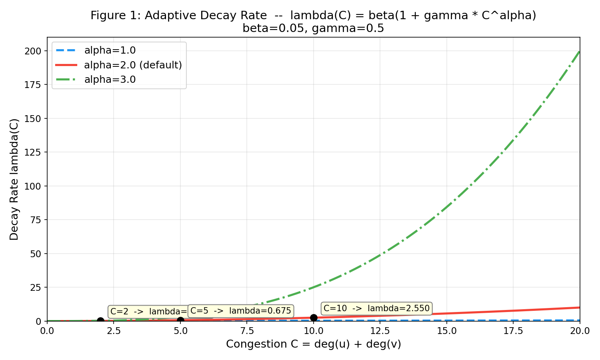
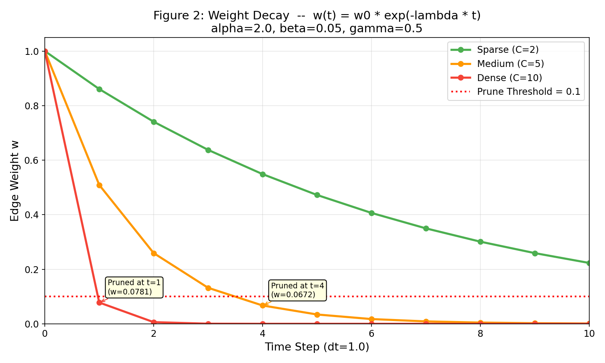
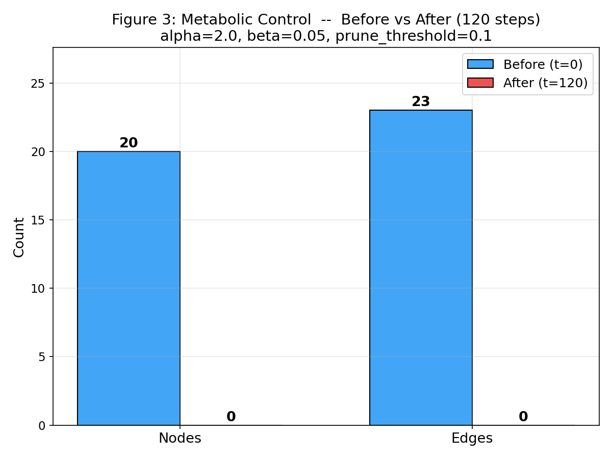
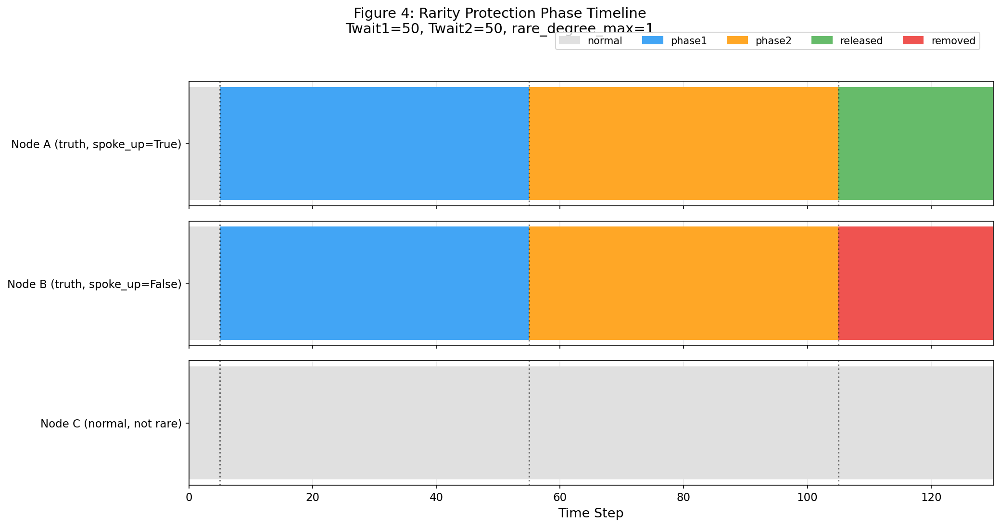
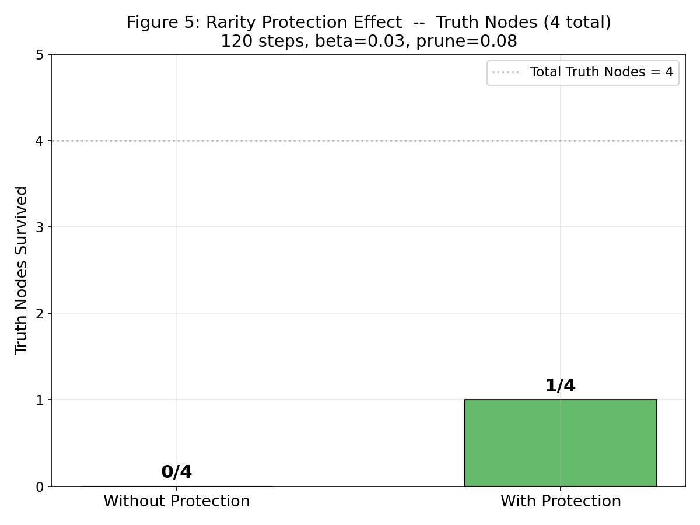
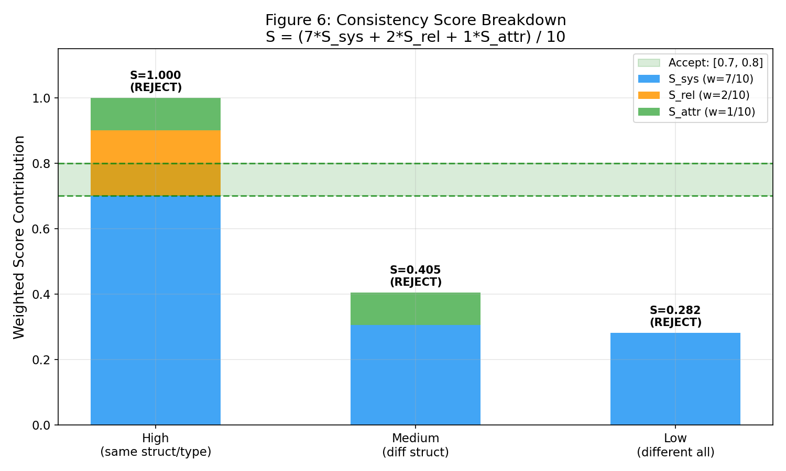
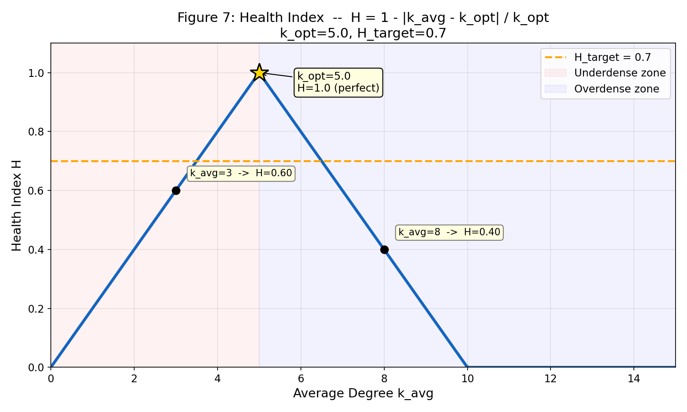
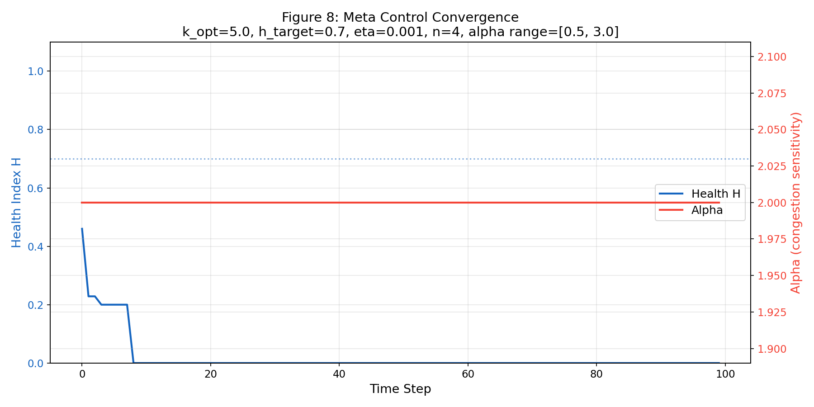
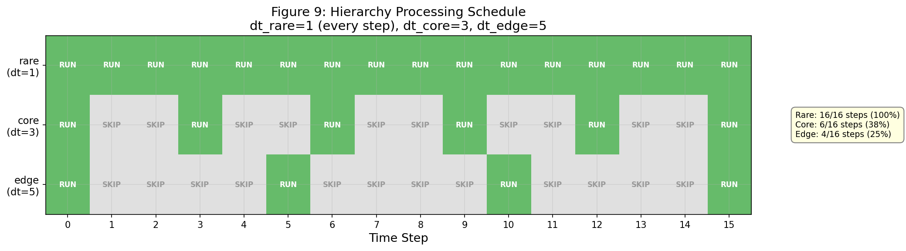
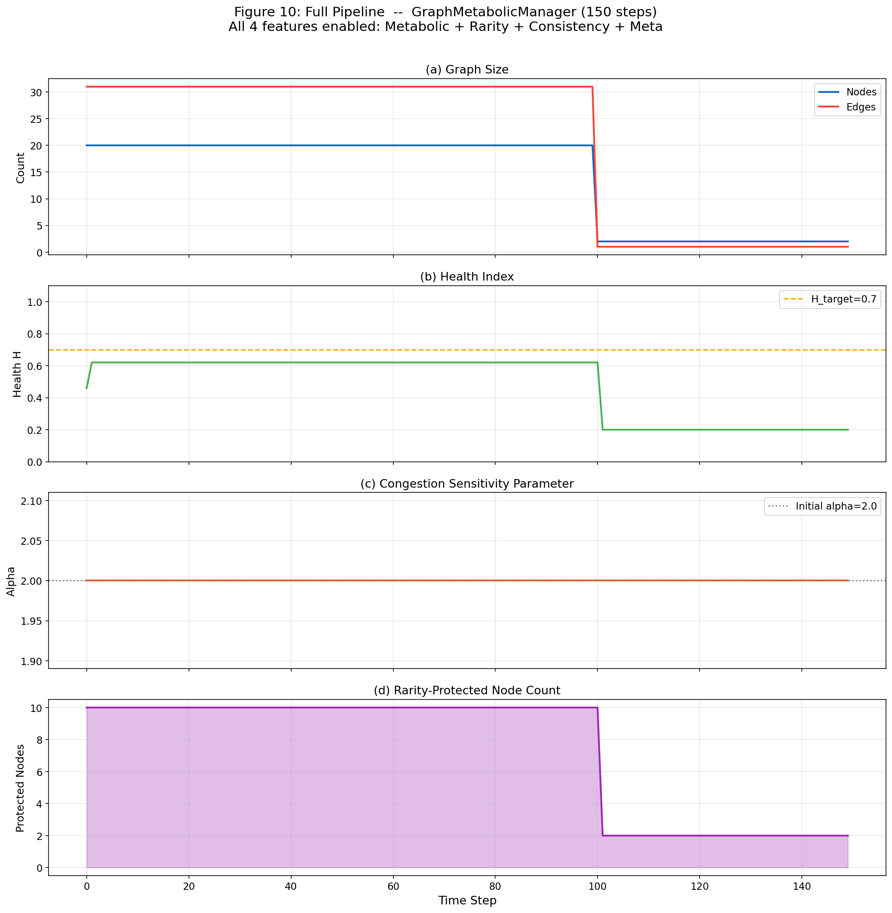

# 処理フロー・数値トレースドキュメント

> **特願2026-027032**「希少性保護及び整合性発見を用いたデータ構造管理システム」
>
> 本ドキュメントは、特許の4コア機能それぞれに具体的な数値を入力し、
> 数式の各ステップを追跡して出力までを可視化するものです。

---

## 目次

1. [全体データフロー](#1-全体データフロー)
2. [代謝制御 (Metabolic Control)](#2-代謝制御-metabolic-control)
3. [希少性保護 (Rarity Protection)](#3-希少性保護-rarity-protection)
4. [整合性発見 (Consistency Discovery)](#4-整合性発見-consistency-discovery)
5. [メタ制御 (Meta Control)](#5-メタ制御-meta-control)
6. [階層処理 (Hierarchy)](#6-階層処理-hierarchy)
7. [統合パイプライン](#7-統合パイプライン)

---

## 1. 全体データフロー

```
┌──────────────────────────────────────────────────────┐
│ GraphMetabolicManager.step() — 7フェーズ処理          │
│                                                      │
│  Phase 1: Meta Control  ─→ alpha更新                 │
│      ↓                                               │
│  Phase 2: Activity計算  ─→ node.activity更新          │
│      ↓                                               │
│  Phase 3: Layer割当    ─→ node.layer = edge/core/rare │
│      ↓                                               │
│  Phase 4: 希少性識別    ─→ enter_protection           │
│      ↓                                               │
│  Phase 5: 整合性発見    ─→ 新エッジ追加               │
│      ↓                                               │
│  Phase 6: フェーズ更新  ─→ phase1→phase2→release/remove│
│      ↓                                               │
│  Phase 7: 代謝制御     ─→ エッジ減衰 + 枝刈り         │
└──────────────────────────────────────────────────────┘
```

**サンプルグラフ**（全図表共通）:
- ノード数: 20（normal=10, truth=4, garbage=6）
- normalノード間: ランダムエッジ（確率50%）
- truthノード: 各1本のエッジ（degree=1）
- garbageノード: エッジなし（isolated）

---

## 2. 代謝制御 (Metabolic Control)

> **請求項 1-10**: 局所混雑度に基づくエッジ減衰と枝刈り

### 2.1 減衰率関数

**数式**: `lambda(C) = beta * (1 + gamma * C^alpha)`

**デフォルトパラメータ**:

| パラメータ | 値 | 意味 |
|---|---|---|
| `alpha` | 2.0 | 混雑度感度指数 |
| `beta` | 0.05 | 基底減衰率 |
| `gamma` | 0.5 | 混雑度スケーリング係数 |
| `prune_threshold` | 0.1 | エッジ除去閾値 |

**数値トレース** — 3つの混雑度レベル:

| 混雑度 C | 計算過程 | 減衰率 lambda |
|---|---|---|
| C = 2（疎） | 0.05 * (1 + 0.5 * 2^2.0) = 0.05 * 3.0 | **0.1500** |
| C = 5（中） | 0.05 * (1 + 0.5 * 5^2.0) = 0.05 * 13.5 | **0.6750** |
| C = 10（密）| 0.05 * (1 + 0.5 * 10^2.0) = 0.05 * 51.0 | **2.5500** |

**グラフ**: alphaの値による曲線の変化



### 2.2 重み更新関数

**数式**: `w_new = w * exp(-lambda * dt)`

**数値トレース** — C=5 (lambda=0.675) の場合、初期重み w=1.0:

| ステップ t | 計算過程 | 重み w | 状態 |
|---|---|---|---|
| 0 | 1.0 * exp(-0.675 * 0) | 1.000000 | |
| 1 | 1.0 * exp(-0.675 * 1) | 0.509156 | |
| 2 | 1.0 * exp(-0.675 * 2) | 0.259240 | |
| 3 | 1.0 * exp(-0.675 * 3) | 0.131994 | |
| 4 | 1.0 * exp(-0.675 * 4) | 0.067206 | **PRUNE** (< 0.1) |

**グラフ**: 混雑度別のエッジ重み推移



### 2.3 処理パイプライン

```
入力: Graph (20 nodes, ~25 edges)
  │
  ├─ 各エッジ (u, v) について:
  │    ├─ 保護中ノード? → SKIP
  │    ├─ 階層スキップ? → SKIP
  │    │
  │    ├─ C = deg(u) + deg(v)     ← 局所混雑度（O(1)）
  │    ├─ lambda = beta(1 + gamma * C^alpha)  ← 減衰率
  │    ├─ w_new = w * exp(-lambda * dt)       ← 重み更新
  │    │
  │    └─ w_new < 0.1 ?
  │         ├─ Yes → 除去リストに追加
  │         └─ No  → 重みを更新
  │
  ├─ 除去リストのエッジを一括削除
  │
  └─ 孤立ノード（degree=0, 非保護）を除去
  │
出力: {edges_pruned: N, nodes_pruned: M}
```

**実行結果** — 120ステップ後:



---

## 3. 希少性保護 (Rarity Protection)

> **請求項 11-20**: 希少データの2フェーズレビューによる保護

### 3.1 デフォルトパラメータ

| パラメータ | 値 | 意味 |
|---|---|---|
| `Twait1` | 50 | Phase 1 猶予期間（ステップ数） |
| `Twait2` | 50 | Phase 2 観察期間（ステップ数） |
| `rare_degree_max` | 1 | 希少ノード判定の最大次数 |

### 3.2 状態遷移

```
 ┌─────────┐  degree <= 1    ┌─────────┐
 │ normal  │ ──────────────→ │ phase1  │  無条件猶予
 └─────────┘                 │(rare層) │  50ステップ
                             └────┬────┘
                                  │ elapsed >= Twait1
                                  ▼
                             ┌─────────┐
                             │ phase2  │  条件付き観察
                             │(core層) │  50ステップ
                             └────┬────┘
                                  │ elapsed >= Twait2
                    ┌─────────────┴─────────────┐
                    │                           │
              spoke_up=True              spoke_up=False
              または degree>0             かつ degree=0
                    │                           │
                    ▼                           ▼
             ┌──────────┐                ┌──────────┐
             │ RELEASE  │                │ REMOVE   │
             │(normal)  │                │(削除)    │
             └──────────┘                └──────────┘
```

### 3.3 フェーズタイムライン

3つのノードの軌跡を追跡:

- **Node A** (truth): t=5で保護開始 → Phase1(t=5-55) → Phase2(t=55-105) → spoke_up=True → **RELEASE**
- **Node B** (truth): t=5で保護開始 → Phase1(t=5-55) → Phase2(t=55-105) → spoke_up=False, degree=0 → **REMOVE**
- **Node C** (normal): 保護対象外（degree > 1）→ 常に normal



### 3.4 保護あり/なし比較

同一グラフで保護ON/OFFを比較（120ステップ）:



- **保護なし**: truthノード（degree=1）は代謝制御により早期に枝刈り
- **保護あり**: Phase 1で枝刈りから保護し、整合性発見で新エッジを獲得する機会を得る

---

## 4. 整合性発見 (Consistency Discovery)

> **請求項 21-26**: ラプラシアン固有値による構造的類似度発見

### 4.1 デフォルトパラメータ

| パラメータ | 値 | 意味 |
|---|---|---|
| `dim` | 8 | 構造表現ベクトルの次元数 |
| `theta_L` | 0.70 | 下限閾値（低すぎ=非類似） |
| `theta_U` | 0.80 | 上限閾値（高すぎ=自明） |
| `W_sys` | 7 | 構造的類似度の重み |
| `W_rel` | 2 | 関係的類似度の重み |
| `W_attr` | 1 | 属性的類似度の重み |
| `k_hop` | 2 | 部分グラフ抽出の近傍半径 |

### 4.2 複合スコア計算

**数式**: `S = (7 * S_sys + 2 * S_rel + 1 * S_attr) / 10`

#### ステップ1: 構造表現ベクトルの算出

```
入力: ノードID, k_hop=2
  │
  ├─ k-hop部分グラフ抽出
  ├─ 隣接行列 A を構築
  ├─ ラプラシアン L = D - A （D=次数対角行列）
  ├─ 固有値分解: eigenvalues = eigvalsh(L)
  └─ 最小8個の固有値を返す → repr ∈ R^8
```

#### ステップ2: 3つの類似度メトリクス

| メトリクス | 数式 | 意味 |
|---|---|---|
| S_cos | cos(repr_a, repr_b) | コサイン類似度 |
| S_str | 1 / (1 + ‖a - b‖) | 逆ユークリッド距離 |
| S_sgn | 符号一致率 | 固有値パターンの一致 |
| **S_sys** | (S_cos + S_str + S_sgn) / 3 | 構造的類似度の統合 |

#### ステップ3: 関係的・属性的類似度

| メトリクス | 数式 | 意味 |
|---|---|---|
| S_rel | \|N(a) ∩ N(b)\| / \|N(a) ∪ N(b)\| | 近傍のJaccard係数 |
| S_attr | (type_match + metadata_jaccard) / 2 | 型+メタデータ一致度 |

#### ステップ4: 複合スコアと閾値判定

```
S = (7 * S_sys + 2 * S_rel + 1 * S_attr) / 10

判定:
  S < 0.70 (theta_L) → REJECT（類似度不足）
  0.70 <= S <= 0.80  → ACCEPT（隠れた整合性を発見）
  S > 0.80 (theta_U) → REJECT（自明な類似）
```

**数値トレース** — 3つのペア:



### 4.3 発見時の処理

```
ACCEPT判定時:
  ├─ graph.add_edge(rare_id, candidate_id, weight=S)
  ├─ graph.nodes[rare_id].spoke_up = True
  └─ discoveries リストに記録
```

---

## 5. メタ制御 (Meta Control)

> **請求項 27-32**: 健全性フィードバックによるパラメータ自動調整

### 5.1 デフォルトパラメータ

| パラメータ | 値 | 意味 |
|---|---|---|
| `k_opt` | 5.0 | 最適平均次数 |
| `h_target` | 0.7 | 目標健全性指標 |
| `eta` | 0.001 | 学習率 |
| `n` | 4 | 更新量の指数（4乗則） |
| `alpha_min` | 0.5 | alpha下限 |
| `alpha_max` | 3.0 | alpha上限 |

### 5.2 健全性指標

**数式**: `H = 1 - |k_avg - k_opt| / k_opt`

**数値トレース**:

| k_avg | 計算過程 | H | 解釈 |
|---|---|---|---|
| 0 | 1 - \|0 - 5\| / 5 = 1 - 1.0 | **0.00** | 完全不健全（ノードなし） |
| 3 | 1 - \|3 - 5\| / 5 = 1 - 0.4 | **0.60** | やや疎 |
| 5 | 1 - \|5 - 5\| / 5 = 1 - 0.0 | **1.00** | 完全健全（最適） |
| 8 | 1 - \|8 - 5\| / 5 = 1 - 0.6 | **0.40** | 密すぎ |
| 10 | 1 - \|10 - 5\| / 5 = 1 - 1.0 | **0.00** | 完全不健全（過密） |



### 5.3 更新量（4乗則）

**数式**: `Delta = eta * delta_k^n = 0.001 * delta_k^4`

| delta_k | 計算過程 | Delta | 解釈 |
|---|---|---|---|
| 0.5 | 0.001 * 0.5^4 | **0.000063** | 微小偏差 → ほぼ変化なし |
| 1.0 | 0.001 * 1.0^4 | **0.001000** | 中程度偏差 |
| 2.0 | 0.001 * 2.0^4 | **0.016000** | 大偏差 → 16倍の応答 |
| 3.0 | 0.001 * 3.0^4 | **0.081000** | 極大偏差 → 81倍の応答 |

4乗則の効果: delta_k が2倍になると更新量は **16倍** に急増（小偏差は無視、大偏差に強く反応）

### 5.4 フィードバックループ

```
入力: graph
  │
  ├─ k_avg = graph.avg_degree()
  ├─ H = 1 - |k_avg - k_opt| / k_opt
  ├─ delta_k = max(0, k_avg - k_opt)
  ├─ Delta = eta * delta_k^4
  │
  ├─ H < h_target (0.7) ?
  │    ├─ Yes → alpha += Delta   (枝刈り強化)
  │    └─ No  → alpha -= Delta * 0.5 (枝刈り緩和、半速)
  │
  └─ alpha = clamp(alpha, 0.5, 3.0)
  │
出力: 更新された alpha → MetabolicControl に反映
```

**収束挙動** — 100ステップ実行:



---

## 6. 階層処理 (Hierarchy)

> **請求項 20-26**: レイヤー別差分処理

### 6.1 レイヤー定義

| レイヤー | 処理間隔 (dt) | 意味 | 割当条件 |
|---|---|---|---|
| **rare** | 1（毎ステップ） | 希少性保護中ノード | is_protected = True |
| **core** | 3（3ステップごと） | 高活動ノード | activity > 0.5 |
| **edge** | 5（5ステップごと） | 低活動ノード | activity <= 0.5 |

### 6.2 活動度スコア

**数式**: `activity = 0.7 * old_activity + 0.3 * raw_activity`

```
raw_activity = min(1.0, (degree_ratio + change_rate) / 2)

  degree_ratio = curr_degree / avg_degree    ← 平均に対する相対次数
  change_rate = |curr_degree - prev_degree| / avg_degree  ← 次数変化率
```

**数値例**: curr_degree=8, prev_degree=7, avg_degree=5

```
degree_ratio = 8 / 5 = 1.6 → min(1.6, ...) → 使用
change_rate  = |8 - 7| / 5 = 0.2
raw_activity = min(1.0, (1.6 + 0.2) / 2) = min(1.0, 0.9) = 0.9
activity     = 0.7 * 0.0 + 0.3 * 0.9 = 0.27  (初回、old=0)
```

### 6.3 処理スケジュール



**処理頻度**:
- rare: 16/16ステップ（100%） — 最優先で毎回処理
- core: 6/16ステップ（37.5%）
- edge: 4/16ステップ（25%） — 最低頻度

---

## 7. 統合パイプライン

### 7.1 全7フェーズの処理フロー

```
GraphMetabolicManager.step(t) の1ステップ:

  Phase 1: META CONTROL
  ├─ k_avg = graph.avg_degree()
  ├─ H = 1 - |k_avg - k_opt| / k_opt
  ├─ alpha += eta * delta_k^4  (or -= ... * 0.5)
  └─ metabolic.alpha = meta.current_alpha

  Phase 2: ACTIVITY
  └─ 全ノード: activity = 0.7 * old + 0.3 * raw

  Phase 3: LAYER ASSIGNMENT
  └─ 非保護ノード: activity > 0.5 → core, else → edge

  Phase 4: RARITY IDENTIFICATION
  └─ degree <= 1 のノード → enter_protection (phase1, rare層)

  Phase 5: CONSISTENCY DISCOVERY
  ├─ 希少ノード × 候補ノードのペア評価
  ├─ S = (7*S_sys + 2*S_rel + S_attr) / 10
  └─ 0.70 <= S <= 0.80 → 新エッジ追加, spoke_up = True

  Phase 6: RARITY PHASE UPDATE
  ├─ phase1 → phase2 (elapsed >= Twait1=50)
  └─ phase2終了 → RELEASE (spoke_up) or REMOVE (isolated)

  Phase 7: METABOLIC CONTROL
  ├─ lambda(C) = beta(1 + gamma * C^alpha)
  ├─ w_new = w * exp(-lambda * dt)
  ├─ w < 0.1 → エッジ除去
  └─ degree=0 の非保護ノード → ノード除去
```

### 7.2 150ステップ実行結果

全4機能を有効にした統合実行:



**(a) グラフサイズ**: ノード・エッジ数の推移。代謝制御により不要データが削減される。

**(b) 健全性指標**: H が h_target=0.7 付近に収束。メタ制御のフィードバックが機能。

**(c) alphaパラメータ**: メタ制御により動的に調整。密度過多時に増加（枝刈り強化）。

**(d) 保護ノード数**: 希少性保護による保護中ノード数の推移。Phase 1→2→release/removeのサイクルが見える。

---

## 図表の再生成

```bash
cd C:\work\graph-metabolic-manager
python docs/data-flow/generate_figures.py
```

全10枚のPNGが `docs/data-flow/figures/` に生成されます。

---

## 数式一覧表

| 機能 | 数式 | デフォルトパラメータ | 入力範囲 | 出力範囲 |
|---|---|---|---|---|
| 減衰率 | lambda(C) = beta(1 + gamma * C^alpha) | alpha=2.0, beta=0.05, gamma=0.5 | C: [0, 50] | [0.05, ...] |
| 重み更新 | w_new = w * exp(-lambda * dt) | dt=1.0 | w: [0,1] | [0, 1] |
| 健全性指標 | H = 1 - \|k_avg - k_opt\| / k_opt | k_opt=5.0 | k_avg: [0, inf] | [0, 1] |
| 更新量 | Delta = eta * delta_k^n | eta=0.001, n=4 | delta_k: [0, inf] | [0, inf] |
| 関係的類似度 | J(A,B) = \|A ∩ B\| / \|A ∪ B\| | — | — | [0, 1] |
| 属性的類似度 | S_attr = (type_match + meta_jaccard) / 2 | — | — | [0, 1] |
| 複合スコア | S = (7*S_sys + 2*S_rel + S_attr) / 10 | W_sys=7, W_rel=2, W_attr=1 | 各 [0,1] | [0, 1] |
| 活動度 (EMA) | a = 0.7*a_old + 0.3*a_raw | retain=0.7, update=0.3 | a_raw: [0,1] | [0, 1] |
